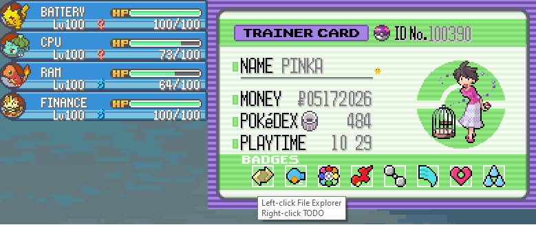
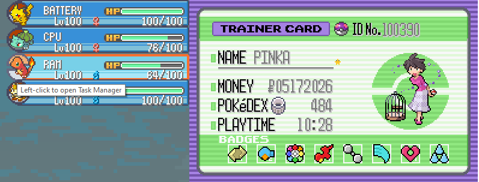
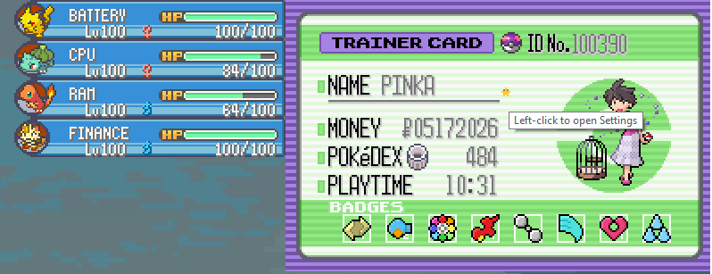

# Trainer Card Dashboard

A custom Pokémon-inspired Rainmeter desktop dashboard I use daily as a playful replacement for the standard Windows taskbar.

I built this because I wanted my desktop to feel more visual, interactive, and personal while still being genuinely useful. The dashboard acts as a launcher and workflow hub for my most-used tools and personal shortcuts.

## Features

- Interactive Pokémon trainer card interface
- Custom app launchers hidden inside sprites, badges, and UI elements
- Hover tooltips explaining each shortcut
- Left-click and right-click actions for different workflows
- Personalized launcher categories for development, media, finance, utilities, and emulators
- Daily-use desktop replacement designed around my actual workflow

## Why I Built It

I like building tools that make my computer feel more like mine. This project started as a fun desktop customization idea and turned into a practical dashboard I use every day.

## Built With

- Rainmeter
- Custom `.ini` skin configuration
- Pixel art assets and UI layout customization
- Windows desktop integration

## Screenshots

### Badge01

### RAM

### Settings

## Credits

All images are from Pokémon.